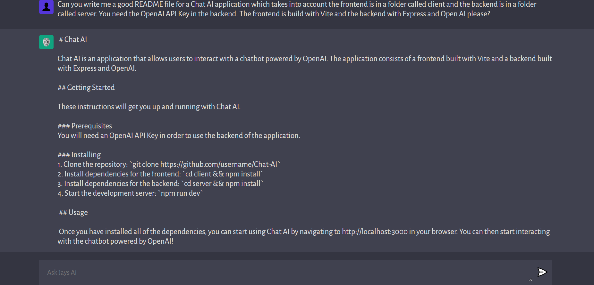

# Build and Deploy Your Own ChatGPT AI Application That Will Help You Code

# Chat AI

Chat AI is an application that allows users to interact with a chatbot powered by OpenAI. The application consists of a frontend built with Vite and a backend built with Express and OpenAI.

## Getting Started

These instructions will get you up and running with Chat AI. 

### Prerequisites 
You will need an OpenAI API Key in order to use the backend of the application. 

### Installing 
1. Clone the repository: `git clone https://github.com/7Jay-Lee7/Chat-AI` 
2. Install dependencies for the frontend: `cd client && npm install` 
3. Install dependencies for the backend: `cd server && npm install` 
4. Start the backend server: `cd server && npm start` 
5. Start the frontend server: `cd client && npm run dev`

 ## Usage 

 Once you have installed all of the dependencies, you can start using Chat AI by navigating to http://localhost:5173 in your browser. You can then start interacting with the chatbot powered by OpenAI!
 
 ## Credits
 Jays Ai Amigo wrote this README file 😊
